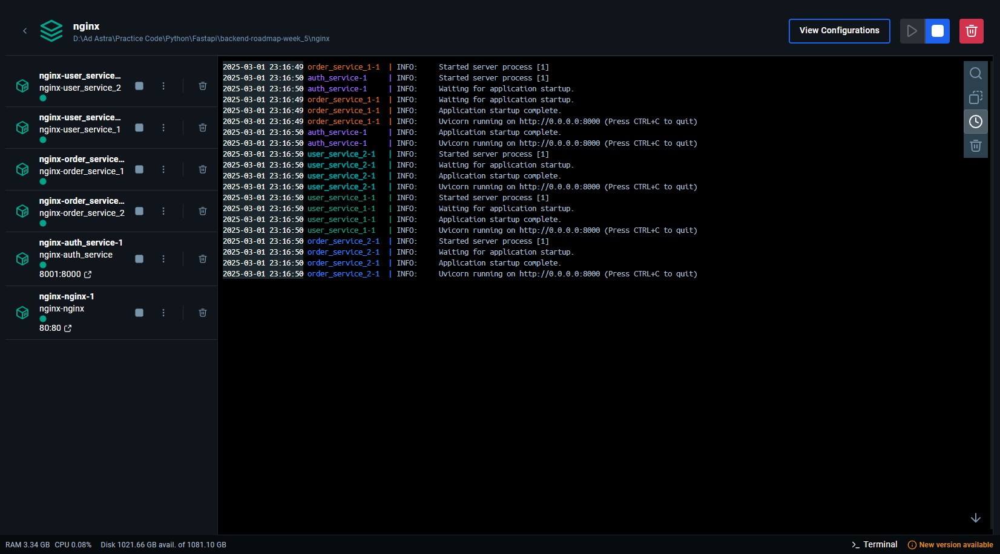

# Microservices Playground: NGINX, FastAPI, and JWT Auth

A hands-on learning project to explore microservices architecture with NGINX routing, load balancing, and JWT authentication using FastAPI and MongoDB.

---

## Overview

This project is a sample microservices system built from scratch to dive into real-world backend and DevOps concepts. It features three services—Auth, User, and Order—connected through an NGINX API Gateway that handles routing, load balancing, and JWT token validation. The goal? Learn how to stitch together modern tools into a scalable, secure setup while keeping it clean and practical.

---

## Features

- **Auth Service**: User registration and login with JWT token generation.
- **User Service**: Fetch user profile details (protected by JWT).
- **Order Service**: Minimal CRUD for orders—create, read, delete (protected by JWT).
- **NGINX API Gateway**:
  - Routes requests to the right service based on URL paths.
  - Validates JWT tokens using a Lua script.
  - Load balances across multiple instances of User and Order services.
- **Dockerized**: Everything runs in containers via Docker Compose.

---

## Tech Stack

- **Backend**: FastAPI (Python) for microservices.
- **Database**: MongoDB (local instance via Compass).
- **API Gateway**: NGINX with OpenResty for Lua scripting.
- **Authentication**: JWT (HS256) with a shared `SECRET_KEY`.
- **Containerization**: Docker and Docker Compose.
- **Libraries**:
  - `pydantic` & `pydantic-settings`: Data validation and config.
  - `python-jose`: JWT handling.
  - `passlib`: Password hashing.
  - `motor`: Async MongoDB access.
  - `lua-resty-jwt`: NGINX-side JWT verification.

---

## Project Structure

```
project-root/
├── nginx/                    # NGINX API Gateway (routing, JWT validation, load balancing)
│   ├── conf.d/               # NGINX configs
│   ├── lua/                  # Lua script for JWT validation
│   ├── .env                  # Secret key for NGINX
│   ├── Dockerfile            # NGINX container setup
│   ├── nginx.conf            # Main NGINX config
│   └── public.pem            # Empty (HS256 doesn't need it)
├── auth_service/             # User auth and JWT generation
├── user_service/             # User profile management
├── order_service/            # Order CRUD operations
├── docker-compose.yml        # Orchestrates all services
└── README.md                 # You're reading it!
```

---

## How It Works

1. **Auth Flow**:
   - Hit `/auth/register` or `/auth/login` to get a JWT token from the Auth Service.
   - Token is signed with `SECRET_KEY` using HS256.

2. **NGINX Gateway**:
   - Routes `/auth/` to Auth Service (no JWT check).
   - For `/users/` or `/orders/`, NGINX runs `jwt_verifier.lua`:
     - Checks the `Authorization: Bearer <token>` header.
     - Verifies the token with `SECRET_KEY`.
     - Extracts `user_id` from the payload and sets `X-User-ID` header.

3. **Service Handling**:
   - User/Order Services receive `X-User-ID` and process requests for that user.
   - Load balancing splits traffic across two instances of User and Order Services.

4. **Data Storage**:
   - MongoDB (`sample_db`) stores `users` and `orders` collections.

---

## Setup

### Prerequisites
- Docker and Docker Compose installed.
- Local MongoDB running with a valid URI (e.g., `mongodb://localhost:27017/sample_db`).

### Steps
1. **Clone the Repo**:
   ```bash
   git clone https://github.com/purushothdl/nginx-testing
   cd nginx-testing
   ```

2. **Set Up Environment**:
   - Ensure `.env` files exist in `nginx/`, `auth_service/`, `user_service/`, and `order_service/`:
     ```
     MONGODB_URL=mongodb://localhost:27017/sample_db
     SECRET_KEY=your-secret-key-here
     ALGORITHM=HS256
     ```
   - NGINX's `.env` only needs `SECRET_KEY=your-secret-key-here`.

3. **Run It**:
   ```bash
   docker-compose up --build
   ```
   - NGINX listens on `http://localhost:80`.
   - Auth Service exposed on `http://localhost:8001` (optional direct access).
   - **Running the System**: Docker Compose output showing NGINX Gateway and load-balanced microservices in action.
     

---

## Testing

### 1. Register a User
```bash
curl -X POST "http://localhost/auth/register" \
-H "Content-Type: application/json" \
-d '{"email": "test@example.com", "password": "pass123"}'
```

### 2. Login and Get Token
```bash
curl -X POST "http://localhost/auth/login" \
-H "Content-Type: application/json" \
-d '{"email": "test@example.com", "password": "pass123"}'
```
- Response: `{"access_token": "<token>", "token_type": "bearer"}`

### 3. Get User Details
```bash
curl -X GET "http://localhost/users/<user_id>" \
-H "Authorization: Bearer <token>"
```

### 4. Create an Order
```bash
curl -X POST "http://localhost/orders" \
-H "Authorization: Bearer <token>" \
-H "Content-Type: application/json" \
-d '{"product": "Laptop", "quantity": 2}'
```

### 5. Get an Order
```bash
curl -X GET "http://localhost/orders/<order_id>" \
-H "Authorization: Bearer <token>"
```

### 6. Delete an Order
```bash
curl -X DELETE "http://localhost/orders/<order_id>" \
-H "Authorization: Bearer <token>"
```

---

## Lessons Learned

- **NGINX Mastery**: Configured routing, load balancing, and Lua-based JWT validation—debugging those "location not allowed" errors was a grind!
- **Microservices**: Built clean, dependency-injected services with FastAPI and a domain-driven vibe.
- **JWT Auth**: Got the hang of token signing/verification and passing user context securely.
- **Docker Compose**: Orchestrated multiple services like a pro—load balancing in action was dope.
- **Real-World Skills**: Tackled practical challenges like env management and proxy headers.

---
